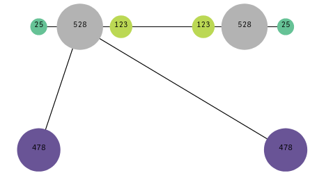

# Constellation chart

This extension displays dots on XY plane with configurable size and color.
Dots can be connected by lines.

## Installation

Save this repository as ZIP and import it via QMC as extension

## Usage

To use this extension, you need to provide following dimensions and measures:

Dimensions:
 
 1. Node ID - unique identification of graph node (displayed as dot)
 2. Connected node ID - identifiers of nodes connected to this node (displayed by lines between dots)

Measures:
 
 1. X coordinate - coordinates will be normalized to fit in extension size
 2. Y coordinate - coordinates will be normalized to fit in extension size
 3. Size factor
 4. Text - displays inside the node
 5. Color - node background as #RGB color code or color name (e.g. red, #FF0000, rgb(255,0,0))

 
 # License
 Author: Tomas Janco, janco@inphinity.xyz
 
 License: MIT
 